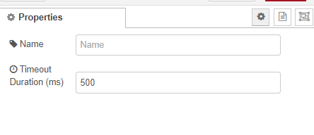
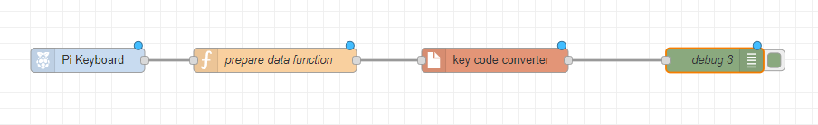

# For convert keycode to char name
Requirement payload is a json object with the following structure:
# Input example
```javascript
nuplayload = {
  "code": 30, // key code of the keyboard
  "action": "down" // action of the keyboard
}
```
# Parameters
- code: key code of the keyboard
- action: action of the keyboard

key enter is 28 || 96
after key enter, the key will send to output and reset or if time duration, the key will send to output and reset
- time duration: 500ms as default

# Output 
```javascript
playload = {
  "text": "xxx", // text of the keyboard
  "status": "success" // status || timeout
}
```

<!-- Image -->



# How to use


In function prepare data
```javascript
let modifiedMsg = msg;
if (typeof msg.payload === 'undefined' && typeof msg.action === 'undefined') 
{
    return; // retrun empty
}
modifiedMsg.payload = {
    "code": msg.payload,
    "action": msg.action
};
return modifiedMsg;
```

# for mapping in keymap: 
```javascript
    const keyCodeToChar = {
    // text
    30: "a", 48: "b", 46: "c", 32: "d", 18: "e", 33: "f", 34: "g", 35: "h", 23: "i", 36: "j", 
    37: "k", 38: "l", 50: "m", 49: "n", 24: "o", 25: "p", 16: "q", 19: "r", 31: "s", 20: "t", 
    22: "u", 47: "v", 17: "w", 45: "x", 21: "y", 44: "z",
    // numbers
    2: "1", 3: "2", 4: "3", 5: "4", 6: "5", 7: "6", 8: "7", 9: "8", 10: "9", 11: "0", 12: "-", 13: "=",
    // numbers pad
    82: "0", 79: "1", 80: "2", 81: "3", 75: "4", 76: "5", 77: "6", 71: "7", 72: "8", 73: "9", 
    83: ".", 74: "-", 78: "+", 55: "*", 98: "/",
    // special characters
    26: "[", 27: "]", 43: `\'`, 39: ";", 40: "'", 51: ",", 52: ".", 53: "/",
  };
```